# AEON SPIRE — City of Wonders

A 700-metre fictional supertall and entertainment campus you can walk through
in a browser, wrapped around a scrubbable 700-day construction programme with
a project-management instrument panel.

Built with **Three.js r185**, the **Web Audio API** and nothing else. Every
texture, every sound and every piece of geometry is generated procedurally at
runtime — there are no downloaded assets, no sample libraries and no build
step required to run it.

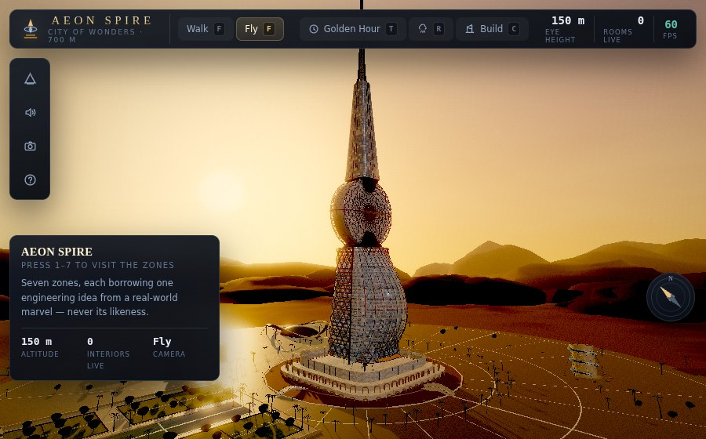

---

## Run it

### The single-file build (recommended for submission)

Open **`dist/AeonSpire.html`** in Chrome, Edge, Firefox or Safari 15+.
Double-clicking the file is enough — three.js and every module are inlined,
so it works from `file://` with no server and no network access.

### From source

```bash
npm run serve        # http://localhost:8181
```

ES modules cannot be loaded from `file://`, so the source tree needs a
server. `index.html` resolves three.js from the CDN
(`cdn.jsdelivr.net/npm/three@0.185.1`) and falls back to the vendored copy in
`assets/vendor/` when the network is unavailable.

Optional URL parameters:

| Parameter | Effect |
|---|---|
| `?quality=low` | Pin the lowest tier — integrated graphics, older laptops, projectors |
| `?quality=medium` | Pin the medium tier |
| `?quality=high` | Pin the highest tier |

Without a parameter the engine picks a tier from device hints and then adapts:
it steps down after 2.5 s below 26 fps and climbs back after 12 s above 55 fps,
so it degrades shadow, particle and post-processing quality rather than
dropping frames.

---

## Controls

| Key | Action |
|---|---|
| **W A S D** | Move / walk |
| **Mouse** | Look around (click the scene to capture the pointer) |
| **Shift** | Sprint / fast-fly |
| **Q / E** | Descend / ascend (fly mode) |
| **F** | Toggle walk ↔ fly mode |
| **1 – 7** | Jump to each of the seven zones — press the same number again to step inside its interiors |
| **T** | Cycle time of day |
| **G** | Force Golden Hour |
| **N** | Force Night |
| **R** | Toggle rain |
| **C** | Toggle Construction Mode |
| **[ / ]** | Scrub the construction timeline back / forward |
| **Space** | Play / pause the construction timeline |
| **M** | Toggle the ambient soundscape |
| **H** | Toggle the help overlay |
| **P** | Photo mode — hide the UI, shallow depth of field |
| **Esc** | Release pointer lock |

The Gantt bar at the bottom of the screen is clickable, and the scrubber
beneath it is draggable.

---

## The building

AEON SPIRE is an **original composite**. Seven zones each borrow one
*engineering idea* from a real-world marvel — never its geometry, its
likeness or its branding.

| Zone | Levels | Engineering idea borrowed | What that becomes here |
|---|---|---|---|
| **1 · The Canal Concourse** | B2–L3 | Venice — a city organised around navigable water | A sunken canal ring 8 m below the plaza, crossed by four arched footbridges, with a dock promenade, electric shuttle boats and a colonnaded market loggia. The canal doubles as part of the greywater and evaporative-cooling loop. |
| **2 · The Sail Atrium** | L4–L30 | Burj Al Arab — a doubly-curved sail skin on a diagrid exoskeleton | A genuinely doubly-curved parametric sail over a full-height atrium, a bronze diagrid, a double-skin facade with a modelled cavity, and five suspended sky-bridges. |
| **3 · The Ring Deck** | L31–L55 | Aldar HQ — a circular structural disc standing on edge | A 110 m disc, 44 m thick, carrying a radial face diagrid; the tower waists through it, and a glass-bottomed halo walkway is cantilevered clear of it on radial ribs and ties. |
| **4 · The Spire Crown** | L56–L88 + spire | Cathedral spires — verticality and rhythm, not ornament | A tapering parametric lattice from 400 m to 700 m with LED-integrated ribs, housing a tuned mass damper and terminating in a broadcast mast and aviation beacon. |
| **5 · The Leaning Observatory** | ground–40 m | Pisa — a lean, declared and then engineered against | A deliberate 8° tilt applied as a rotation on the whole annex, resolved by six post-tensioned cable anchors and an asymmetric caisson offset against the lean. |
| **6 · Reflection Court & Pyramid Pavilion** | ground | Taj Mahal axial symmetry + Giza's pure geometry | A 174 m mirror-symmetrical reflecting pool, and four planted quadrants with dressed stone kerbs, sunk irrigation rills and a palm at every crossing, leading to a glass-and-stone pyramid housing the sustainability core — geothermal exchange, a solar chimney and the rainwater cistern. |
| **7 · The Wonder Annex** | ground | Three engineering set-pieces: a banked test loop, a corbelled cassette stack, a doubly-curved gridshell | The **Speed Ribbon** — a 300 m banked loop lifted over the motorsport pavilion on eight raking piers, its deck rolled by the curvature it resists; the **Modular Block Pavilion** — a stone maker hall carrying seven prefabricated whole-floor cassettes, each turned 13° and reaching further out than the one below until the top floor stands 15 m clear; and the **Themed Promenade** — a gridshell whose rise swells down the street and whose crown slides off the centreline, so no two glazed panels are the same shape. |

### The cladding

Everything on the campus that is glazed wears the same procedural curtain
wall: unitised panels with mullions, transoms and spandrel bands, per-unit
tint and roughness jitter, and a shallow pillow in the normal map that
reproduces the wavy reflection laminated glass has under wind load. The
alpha map is the part that matters — spandrels nearly opaque, vision glass
not — so floor lines read from a kilometre out instead of the tower being
one tinted balloon. Architectural metals sit at metalness 0.34–0.4, and the
environment probe desaturates the sky 45% toward luminance before filtering,
because a building mirroring a blue zenith is not a blue building.

**Height breakdown:** podium 18 m · sail atrium 124 m · ring deck 110 m ·
occupied crown 148 m · lattice spire 300 m = **700 m** to the tip of the mast.

### The interiors

All **31 named interior spaces** of the brief are modelled and furnished —
not a subset, and not exterior shells. Each carries its zone's own material
palette and lighting character, and each has three animated or interactive
props, so no room is a static backdrop.

<details>
<summary>The full list of 31 spaces</summary>

**Canal Concourse** — B2 Water Arrival Hall · B1 Market Loggia · L1 Canalside
Promenade Interior · L2 Mezzanine Overlook · L3 Tower Transfer Lobby

**Sail Atrium** — Grand Lobby · Cascading Water Wall · Suspended Sky-Bridges ·
Sweeping Cantilever Staircase · Typical Guest/Office Floor · Sky Lobby Transfer

**Ring Deck** — Halo Walkway Interior · Ring-Level Sky Gardens · Observation
Lounge · Typical Ring Floor Interior · Seismic Joint Viewing Gallery

**Spire Crown** — Sky-Lobby Transfer Floor · Lattice Stair / Viewing Gallery ·
Tuned Mass Damper Chamber · Broadcast & Beacon Room

**Leaning Observatory** — Entry Hall · Spiral Marble Stair · Tilt-Corrected
Visitor Lounge · Rooftop Tilted Terrace

**Reflection Court** — Pyramid Atrium · Solar Chimney Core · Geothermal &
Mechanical Viewing Gallery · Garden Court Interior Halls

**Wonder Annex** — Motorsport Pavilion Interior · Modular Block Pavilion
Interior · Themed Promenade Arcade

</details>

Interiors are built lazily the first time the camera comes near, culled by
distance when it leaves, and each publishes an acoustic profile that swaps the
convolver's impulse response as you move between rooms — a stone vault, a
glass atrium and a padded lounge do not sound alike.

---

## Presenting this for a Project Management course

### The programme, as a Gantt chart and a critical path

The construction simulation compresses a fictional 700-day schedule into ten
milestones. Bar widths in the on-screen Gantt are proportional to each
package's real duration, so the chart is a schedule rather than ten equal
boxes.

| # | Milestone | Days | Duration | Cumulative budget | Critical path |
|---|---|---|---|---|---|
| 1 | Site clearing & survey | 0–40 | 40 d | 3% | ● |
| 2 | Excavation & piling | 40–110 | 70 d | 11% | ● |
| 3 | Foundation & raft slab pour | 110–175 | 65 d | 20% | ● |
| 4 | Core & podium rising | 175–265 | 90 d | 33% | ● |
| 5 | Sail Atrium steel erection | 265–350 | 85 d | 46% | ● |
| 6 | Ring Deck cantilever install | 350–435 | 85 d | 58% | ● |
| 7 | Spire topping-out | 435–505 | 70 d | 68% | ● |
| 8 | Facade glazing & MEP | 505–590 | 85 d | 82% | ● |
| 9 | Interior fit-out & landscaping | 590–665 | 75 d | 94% | ● |
| 10 | Completion & opening | 665–700 | 35 d | 100% | ● |

**The critical path runs through all ten.** That is deliberate and it is the
most useful thing on the chart: a supertall's structure is an almost purely
serial dependency chain — you cannot glaze a floor that does not exist, and
you cannot erect the ring deck before the core reaches it. There is no float
anywhere in the vertical sequence, which is why milestone 8 (facade glazing,
the longest package by value and the most weather-dependent) is the schedule's
principal risk.

The two zones that are **not** on the critical path are the Leaning
Observatory and the Wonder Annex. Both are structurally independent of the
tower, and the simulation shows this: the Observatory appears at milestone 5
and the Annex at milestone 9, in each case because they *can* be built in
parallel rather than because they must wait. That contrast — a serial spine
with parallel satellites — is the clearest available illustration of what a
critical path actually constrains.

### Earned value

The HUD is an earned-value instrument panel, not a score display. Four curves
are tracked and three are shown:

- **PV — planned value.** The budget curve, interpolated between milestones.
- **AC — actual cost.** Runs ahead of plan through the middle of the job and
  recovers late, which is the shape most construction projects actually
  produce.
- **EV — earned value.** Deliberately a little behind actual cost mid-
  programme.
- **SPI = EV / PV** and **CPI = EV / AC**, colour-graded so a slipping index
  reads at a glance: green at or above 1.0, amber below 1.0, red below 0.95.

Scrub to day 505 and the panel reads SPI 0.973, CPI 0.911 — the project is
very slightly behind schedule and meaningfully over cost, which is the
conversation the numbers exist to start. Against a fictional $2.4bn capital
cost, the budget ticker converts that into money.

### The Leaning Observatory as a worked risk-management example

The Observatory is the clearest risk case in the project because the risk is
*designed in* rather than discovered.

- **The risk.** An 8° structural tilt. Left alone it produces progressive
  differential settlement, an unserviceable floor plate, and eventually a
  stability failure.
- **The response.** Not avoidance — the tilt is the whole point of the
  building — but *mitigation*: six post-tensioned cable anchors restraining
  the up-slope side, and an asymmetric caisson foundation offset 5.5 m against
  the direction of lean.
- **The residual risk, accepted and managed.** The floors are still tilted.
  The response is operational rather than structural: lounge furniture stands
  on hydraulic levelling plinths that visibly adjust, and the roof terrace
  deliberately leaves the lean uncorrected so visitors feel it underfoot.
- **The verification.** In the Entry Hall a plumb line hangs true while the
  building leans around it, and the terrace carries a spirit level whose
  bubble sits hard against one end.

In the model the tilt is applied as a rotation on the entire annex group, so
the "off" look of the Entry Hall's concentric floor inlay is a genuine
consequence of the geometry rather than a texture painted to look skewed.
That honesty is the point: the risk register and the model agree.

### Why this is an original composite

Every zone borrows an engineering *concept* and expresses it in original
geometry. The Ring Deck is a circular structural disc because Aldar HQ proved
a disc on edge works, but its dimensions, its waisted shaft, its halo walkway
and its diagrid are this project's. The Sail Atrium is a doubly-curved skin on
a diagrid because the Burj Al Arab established the type, but the surface is
generated here from a parametric function whose parameters are in
`src/world/SitePlan.js`. No real building's geometry is reproduced, no
trademarked logo or brand name appears anywhere, and the concept vehicle in
the Motorsport Pavilion is a pure aerodynamic silhouette belonging to no
marque. Nothing in the scene is copied; everything in it is argued for.

---

## Gallery

| | |
|---|---|
| 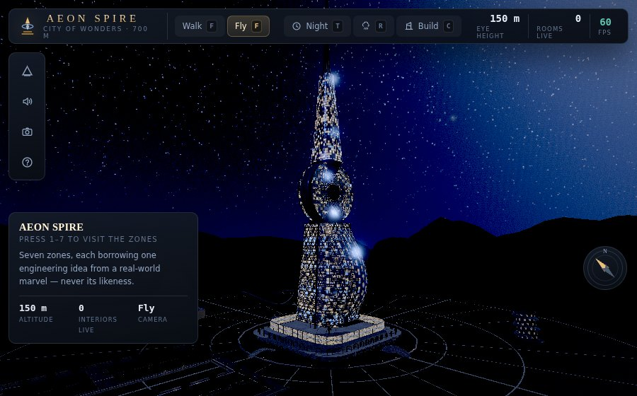 | 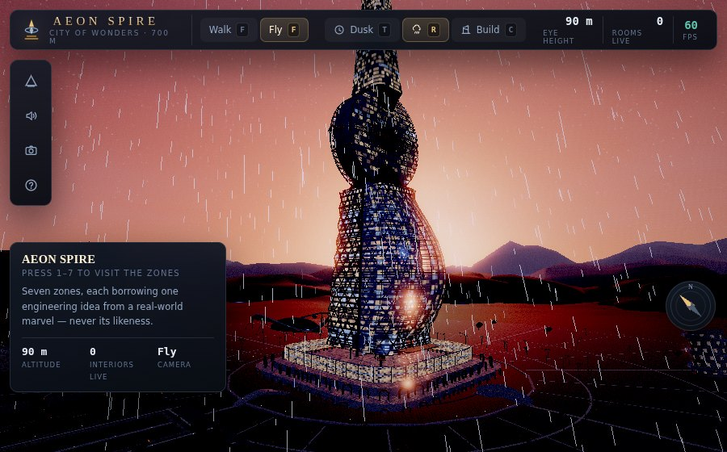 |
| **Night** — lit windows scattered through the curtain wall, moonlight raking the sail, the aviation beacon pulsing at 700 m | **Rain at dusk** — wind-blown streaks, wet surfaces, the canal rippling harder |
| 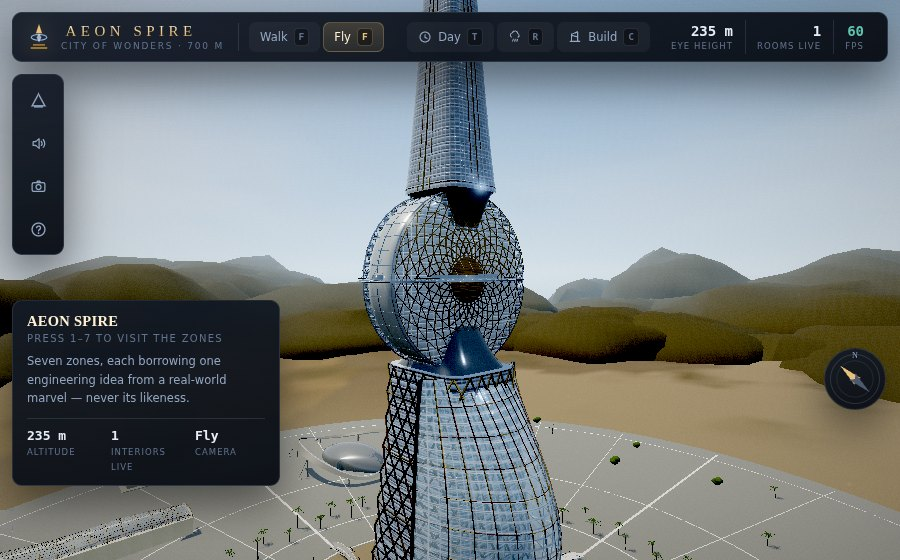 | 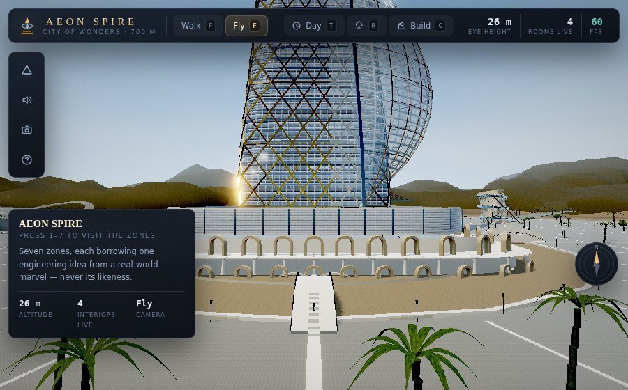 |
| **The Ring Deck** — a 104 m disc on edge, bronze radial face diagrid, the tower waisting through it | **The Canal Concourse** — the sunken canal, arched footbridges, the market arcade |
| 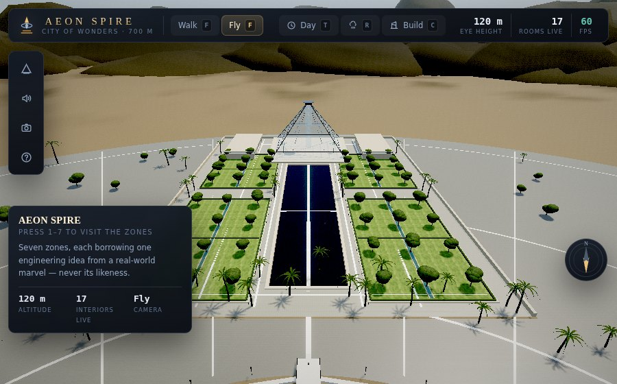 | 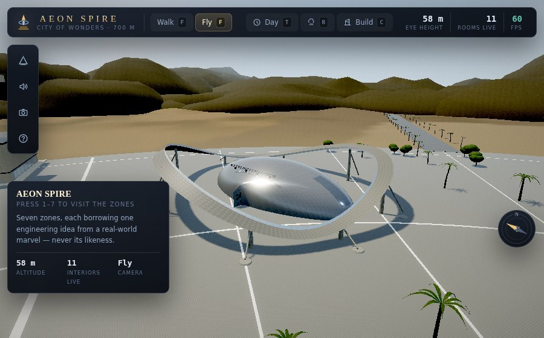 |
| **The Reflection Court** — a 174 m reflecting pool on the axis, four kerbed parterres with sunk irrigation rills, the pyramid closing the view | **The Speed Ribbon** — a 300 m banked test loop lifted over the motorsport pavilion on eight raking piers |
| 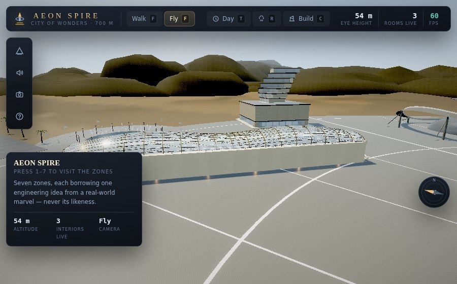 | 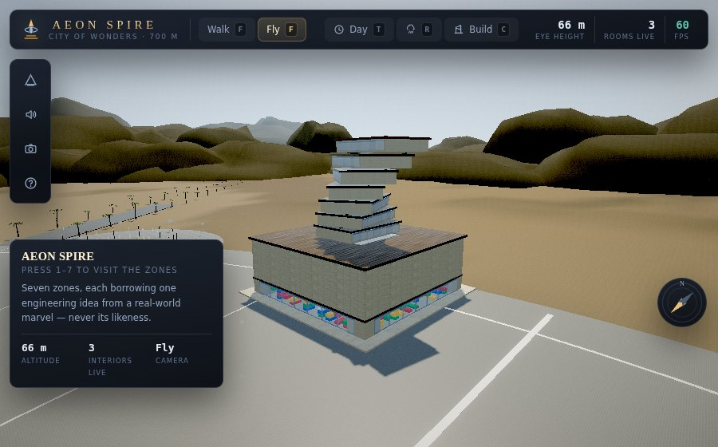 |
| **The Themed Promenade** — a doubly-curved gridshell whose rise swells down the street and whose crown slides off the centreline | **The Modular Block Pavilion** — seven whole-floor cassettes, each turned 13° and reaching further out than the one below |
| 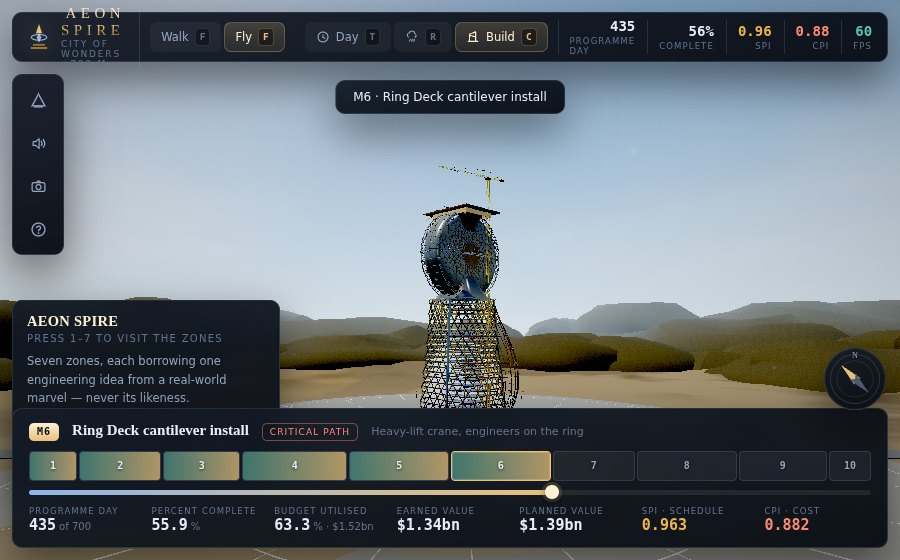 | 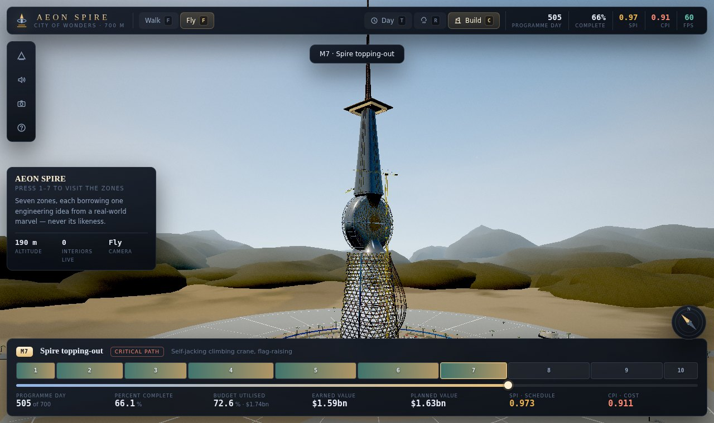 |
| **Construction, milestone 6** — bare diagrid, the disc going in, hoarding and haul road, no landscaping yet | **The PM panel at milestone 7** — duration-weighted Gantt, day 505 of 700, SPI 0.973, CPI 0.911 |

---

## Technical notes

### Stack

- **Three.js r185 (0.185.1)** — the only dependency. Verified at build time by
  downloading the published package and importing it under Node (441 exports,
  `REVISION === '185'`).
- **Web Audio API** for the entire soundscape.
- **Vanilla ES modules**, no bundler required to develop.

The addon bundle is deliberately *not* used. Post-processing, geometry merging
and the impulse responses are all implemented directly here, so there is
exactly one thing that can fail to resolve at runtime.

### Things worth looking at in the code

| File | What it does |
|---|---|
| `src/world/SitePlan.js` | Every dimension in the project, in one place. Re-proportion the building here. |
| `src/core/Textures.js` | ~30 procedural materials — limestone, travertine, herringbone brick, radial terrazzo, bronze, expanded mesh — each generating albedo, normal (Sobel from a height field) and roughness maps. |
| `src/core/PostFX.js` | Bloom, depth of field, ACES tonemapping and per-mode colour grading, written against `WebGLRenderTarget`. |
| `src/audio/Synth.js` | Every sound in the project, synthesised: pink and brown noise beds, water, rain, thunder, birdsong, crickets, a generative pad, construction foley, and seven convolver impulse responses. |
| `src/construction/ConstructionSite.js` | The build-height clipping plane that reveals the tower course by course. |
| `src/world/BuildKit.js` | Lofting, parametric surfaces, diagrids, trusses, date palms and a geometry merger written from scratch (`BufferGeometryUtils` is an addon). |
| `TextureFactory.curtainWall` | The campus's cladding module: unitised panels with mullions, transoms and spandrel bands, per-unit tint and roughness jitter, a pillowed normal map, and the alpha map that lets floor lines read from a kilometre out. |
| `WonderAnnex.buildSpeedRibbon` | The banked loop. The deck's roll is set by the curvature it resists, so the surface is warped along its whole length. |
| `src/scene/Environment.js` | The environment probe, and the 45% desaturation that keeps a building mirroring a blue zenith from becoming a blue building. |

### Performance

The E.9 target is 30–60 fps on a mid-range laptop. The measured budget:

| Metric | Value |
|---|---|
| Draw calls, exterior view | ~155 |
| Draw calls, all 31 interiors revealed at once | ~520 |
| Triangles, all interiors revealed | ~368,000 |
| CPU simulation cost, all interiors live | **0.22 ms/frame** |
| Modules | 36 |
| Single-file build | 2.6 MB |

Techniques used: geometry merging (a thousand-part facade reaches the GPU as
one call), instancing (workers cost six calls for ninety figures; trees,
lanterns, blocks and stillages are all instanced), lazy interior construction,
distance-based room culling, a shadow camera that follows the viewer with
texel snapping, and three quality tiers with automatic adaptation.

### Verification

```bash
npm run verify              # 37 checks in real Chromium
node tools/verify.mjs --full   # plus the Section G master walkthrough
node tools/build.mjs        # rebuild dist/AeonSpire.html
node tools/shoot.mjs        # regenerate docs/screenshots/
```

`tools/verify.mjs` drives the actual page in headless Chromium (WebGL 2 via
SwiftShader) and fails on any console error, page error or failed request. It
checks that every one of the 31 interiors builds, that all 17 controls work,
that the time-of-day transition genuinely interpolates rather than cutting,
that rain wets all 106 exterior materials and that surfaces dry afterwards,
that all ten milestones produce distinct build heights, and that the campus
restores correctly when construction mode is switched off.

One honest caveat about the numbers: SwiftShader is a software rasteriser
roughly two orders of magnitude slower than any real GPU, so the frame rate
the harness reports is meaningless. That is why the performance gate measures
CPU simulation cost and draw-call/triangle budgets instead — those *are*
representative of real hardware.

---

## Assets and licensing

- **Textures** — all original and procedural, generated at runtime in
  `src/core/Textures.js` from the noise primitives in `src/core/Noise.js`.
  Nothing is downloaded; no texture library is used.
- **Audio** — all original and synthesised at runtime in `src/audio/Synth.js`
  from noise buffers and oscillators, including the seven convolver impulse
  responses. No samples, no CC0 library, no recordings.
- **Geometry** — all generated in code. No imported models.
- **Third-party code** — Three.js r185 only, MIT licensed. The licence text is
  vendored at `assets/vendor/THREE-LICENSE.txt`.
- **No trademarked logos, brand names, real building geometry or copyrighted
  characters appear anywhere in the scene.**

Project code: MIT.

---

## Project layout

```
aeon-spire/
  index.html                  CDN-first bootstrap with a vendored fallback
  BUILD_PROMPT.md             the build directive this was made from
  PROGRESS.md                 phase-by-phase Definition-of-Done record
  src/
    main.js                   wiring, and the automation surface on window.AEON
    core/       Engine PostFX Materials Textures Noise MathUtil
    scene/      SceneManager Sky Lighting TimeOfDay Weather Environment
    world/      SitePlan BuildKit Rooms
    zones/      Zone + the seven zone modules
    interiors/  InteriorKit
    construction/ ConstructionTimeline ConstructionSite Crane Truck Worker
    audio/      AudioManager Synth
    ui/         HUD Controls
  assets/vendor/              three.js r185 + its licence
  tools/        serve.mjs build.mjs verify.mjs shoot.mjs
  dist/AeonSpire.html         the single-file build
  docs/screenshots/
```
